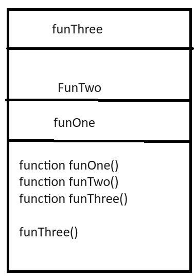

# In Memory Storage

These notes are based on this [article](https://www.freecodecamp.org/news/understanding-the-javascript-call-stack-861e41ae61d4).

## What is a ‘call’?

A call is a invocation of a function.

## How many ‘calls’ can happen at once?

One at a time.

## What does LIFO mean?

Last in First Out.

## Draw an example of a call stack and the functions that would need to be invoked to generate that call stack.

<!-- markdownlint-disable -->

    

<!-- markdownlint-enable -->

## What causes a Stack Overflow?

A stack overflow happens when a recusrive function calls itself without an exit point.

## What is a ‘reference error’?

When you use a variable that is not delcared.

## What is a ‘syntax error’?

This is when you have a line of code that can not be parsed.

## What is a ‘range error’?

This error occurs when you try to access a thing outside of a range.

## What is a ‘type error’?

`Like the name indicates, this types of errors show up when the types (number, string and so on) you are trying to use or access are incompatible, like accessing a property in an undefined type of variable.` [article](https://codeburst.io/javascript-error-messages-debugging-d23f84f0ae7c).

## What is a breakpoint?

A break point is where you want to halt execution in your debugger so you can step through your code from there.

## What does the word ‘debugger’ do in your code?

The debugger keyword keeps the history from its invocation to the break point.
